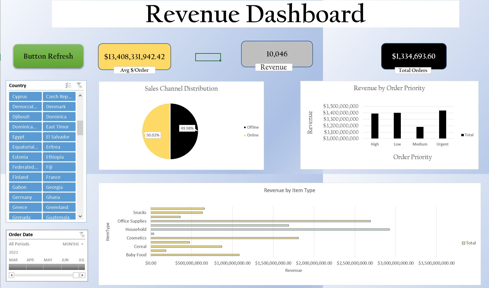
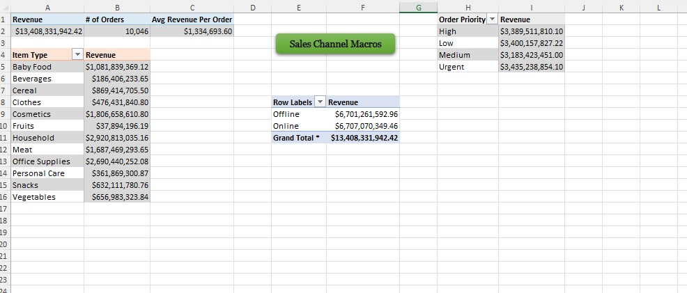

# Excel & Power Query & Power Pivot  & Macros to refresh the data

- Data Processing & Automation: Analyzed and processed 20,000+ rows of sales data, leveraging Power Query to automate data extraction, transformation, and cleaning, resulting in a 30% reduction in manual data preparation time.
- Advanced Analytical Tools: Used Power Pivot to build complex data models, applying advanced DAX formulas to aggregate sales data across multiple dimensions, providing deeper insights into key performance metrics.
- Dashboard Creation & Visualization: Designed interactive, dynamic dashboards using Pivot Tables and Excel charts, visualizing multi-year revenue trends, sales performance by region, and product categories, empowering leadership with real-time data for decision-making.
- Process Automation with Macros: Developed and implemented macros to streamline repetitive reporting tasks, reducing report generation time by 40% and ensuring consistent formatting across reports.

## Requirements

--Download all the files

## Installation

1. Load data in Excel:

## Images

